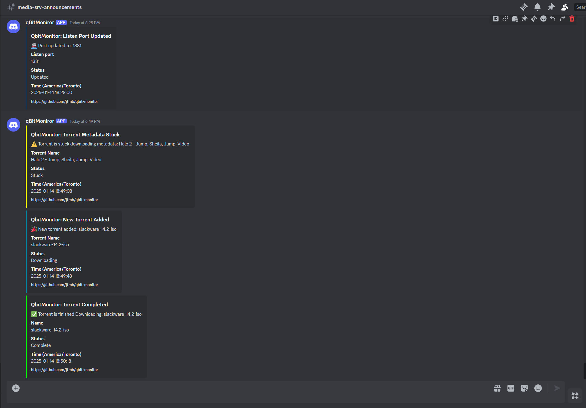
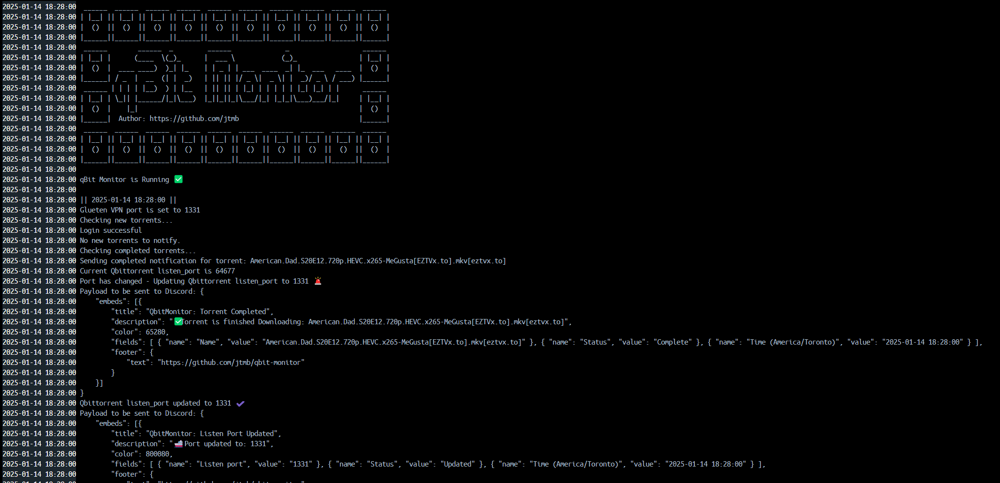

<h1 align="center">
  <a href="https://github.com/jtmb">
    
  </a>
</h1>

<div align="center">
  <b>qbit-monitor</b> - Monitor your qBittorrent WEBUI and get push notifications.
  <br />
  <br />
  <a href="https://github.com/jtmb/qbit-monitor/issues/new?assignees=&labels=bug&title=bug%3A+">Report a Bug</a>
  ·
  <a href="https://github.com/jtmb/qbit-monitor/issues/new?assignees=&labels=enhancement&template=02_FEATURE_REQUEST.md&title=feat%3A+">Request a Feature</a>
  .
  <a href="https://hub.docker.com/repository/docker/jtmb92/qbit-monitor/general">Docker Hub</a>
</div>
<br>
<details open="open">
<summary>Table of Contents</summary>

- [About](#about)
- [Prerequisites](#prerequisites)
- [Getting Started](#getting-started)
    - [Docker Image](#docker-image)
    - [Running on Docker](#running-on-docker)
    - [Running on Docker Compose](#running-on-docker-compose)
    - [Backing up to remote locations](#backing-up-to-remote-locations)
    - [Performing an adhoc (one time) backup](#performing-an-adhoc-one-time-backup)
    ### 
- [Environment Variables Explained](#environment-variables-explained)
- [Contributing](#contributing)
- [License](#license)

</details>
<br>

---

### <h1>About ( What problem does this solve? )</h1>

This application enhances your qBittorrent experience with two powerful features:

1. **Torrent Monitoring & Discord Notifications**  
   Automatically monitors your qBittorrent for new and completed torrents, sending real-time notifications to your Discord channel. It also handles stuck torrents caused by metadata issues, keeping your downloads running smoothly.

2. **ProtonVPN Port Forwarding Integration**  
   If you're using the GluetenVPN container for ProtonVPN, you know the pain of random port assignments after each container restart. This application solves that problem by automatically checking the VPN-assigned forwarded port and updating your qBittorrent configuration accordingly.

---

### Features:
- Real-time torrent status notifications on Discord.
- Automatic resolution of metadata-stuck torrents.
- Seamless integration with ProtonVPN for dynamic port forwarding.
- Easy setup and lightweight operation.

Take your qBittorrent setup to the next level! 🚀


<details>
  <summary>View Screenshots</summary>
  <div style="display: flex; gap: 10px; margin-top: 10px;">
    
    
  </div>
</details>


## Prerequisites

- Docker installed on your system

### <h2>Getting Started</h2>
### [Docker Image](https://hub.docker.com/r/jtmb92/qbit-monitor)
```docker
 docker pull jtmb92/qbit-monitor
```

> <span style="color:yellow;"> **Note:**</span> This container does not run as `root`. To ensure proper functionality, you must take ownership of the required directories on your host system and set the correct permissions before starting the container. For example:

```bash
username=$(whoami):
sudo chown $username:$username /mnt/qbit-monitor
sudo chmod 755 /mnt/qbit-monitor
```


### Running on Docker Compose  
Run on Docker Compose (this is the recommended way) by running the command "docker compose up -d".  
```yaml
services:
  qbit-monitor:
    image: docker.io/jtmb92/qbit-monitor
    container_name: qbit-monitor
    depends_on:
        qbittorrent:
            condition: service_started
            restart: true
    environment:
      DISCORD_WEBHOOK_URL: your-discord-token-here
      QBITTORRENT_HOST: "http://qbittorrent:8112"
      QBITTORRENT_USERNAME: "admin"
      QBITTORRENT_PASSWORD: "admin1234"
      PORT_FORWARDING: "on"
      PORT_FORWARD_FILE: /mnt/gluetun/forwarded_port
      CHECK_INTERVAL_FORWARDED_PORT: 1h
      PORT_UPDATED_NOTIFICATION: "on"
      CHECK_INTERVAL_TORRENT_MONITORING: 10s
      NEW_DOWNLOAD_NOTIFICATION: "on"
      METADATA_STUCK_NOTIFICATION: "on"
      DOWNLOAD_COMPLETE_NOTIFICATION: "on"
      PUID: "1000"
      PGID: "1000"
    volumes:
      - /mnt/gluetun:/mnt/gluetun
      - /mnt/qbit-monitor:/app/state
```

## Environment Variables Explained  

- `DISCORD_WEBHOOK_URL: your-discord-token-here`
  - The URL of the Discord webhook used to send notifications.

- `QBITTORRENT_HOST: "http://qbittorrent:8112"`
  - The URL for the qBittorrent web interface, including the protocol and port.

- `QBITTORRENT_USERNAME: "admin"`
  - The username for authenticating with the qBittorrent web interface.

- `QBITTORRENT_PASSWORD: "admin1234"`
  - The password for authenticating with the qBittorrent web interface.

- `PORT_FORWARDING: "on"`
  - Specifies whether port forwarding is enabled or disabled. Use `on` to enable and `off` to disable.

- `PORT_FORWARD_FILE: /mnt/gluetun/forwarded_port`
  - The file path on the host machine where the forwarded port information is stored.

- `CHECK_INTERVAL_FORWARDED_PORT: 10s`
  - The time interval for checking and updating the forwarded port, defined in seconds (`s`), minutes (`m`), or hours (`h`).

- `PORT_UPDATED_NOTIFICATION: "on"`
  - Specifies whether notifications for updated ports are enabled or disabled. Use `on` to enable and `off` to disable.

- `CHECK_INTERVAL_TORRENT_MONITORING: 10s`
  - The time interval for monitoring torrents, defined in seconds (`s`), minutes (`m`), or hours (`h`).

- `NEW_DOWNLOAD_NOTIFICATION: "on"`
  - Specifies whether notifications for new downloads are enabled or disabled. Use `on` to enable and `off` to disable.

- `METADATA_STUCK_NOTIFICATION: "on"`
  - Specifies whether notifications for torrents stuck on metadata are enabled or disabled. Use `on` to enable and `off` to disable.

- `DOWNLOAD_COMPLETE_NOTIFICATION: "on"`
  - Specifies whether notifications for completed downloads are enabled or disabled. Use `on` to enable and `off` to disable.

- `PUID: "1000"`
  - The user ID to run the container processes as, matching the host system's user.

- `PGID: "1000"`
  - The group ID to run the container processes as, matching the host system's group.


## Volumes Explained  

- `/mnt/gluetun:/mnt/gluetun`
  - Maps the host directory `/mnt/gluetun` where the port_forward file is located, only required if `PORT_FORWARDING` is set to `on`.

- `/mnt/qbit-monitor:/app/state`
  - Maps the host directory `/mnt/qbit-monitor` to the container directory `/app/state`, used for storing state information.


## Contributing

First off, thanks for taking the time to contribute! Contributions are what makes the open-source community such an amazing place to learn, inspire, and create. Any contributions you make will benefit everybody else and are **greatly appreciated**.

Please try to create bug reports that are:

- _Reproducible._ Include steps to reproduce the problem.
- _Specific._ Include as much detail as possible: which version, what environment, etc.
- _Unique._ Do not duplicate existing opened issues.
- _Scoped to a Single Bug._ One bug per report.

## License

This project is licensed under the **GNU GENERAL PUBLIC LICENSE v3**. Feel free to edit and distribute this template as you like.

See [LICENSE](LICENSE) for more information.